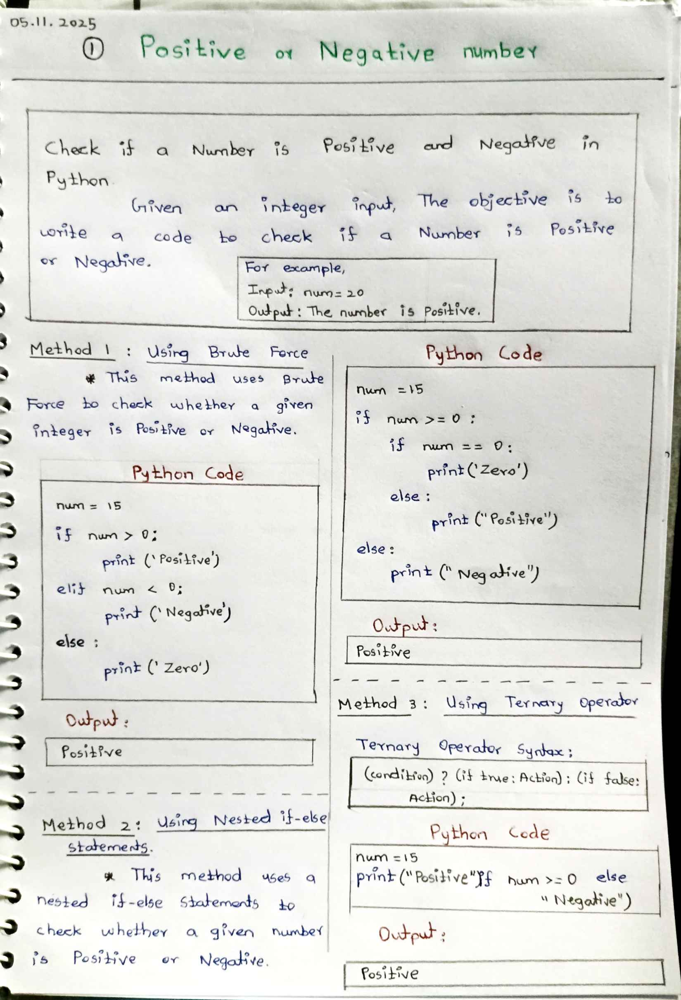
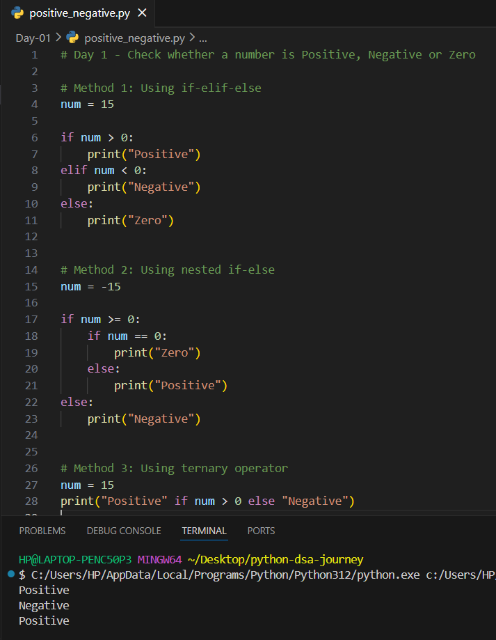

# Day 01 – Check Positive or Negative Number (Python)

## 📌 Problem Statement
Write a Python program to check whether a given number is **positive**, **negative**, or **zero**.

---

## 🧠 Concepts Used
- Conditional statements (if, elif, else)
- Comparison operators
- Ternary operator
- Basic Python syntax

---

## 🧪 Methods Implemented
1. Using simple if-elif-else  
2. Using nested if-else  
3. Using ternary operator  

---

## 📷 Notes & Output

### ✏️ Handwritten Notes

### 🖥️ Code and Output Screenshot

---

## ✅ Learning Outcome
- Understood how conditional logic works
- Learned multiple approaches to solve one problem
- Improved logical thinking in Python

---

## 🚀 Next Step
Continue learning DSA with basic problems and improve problem-solving skills.

---

### 🔗 Author
**[Gurumoorthi N]**  
Learning Python & DSA 🚀