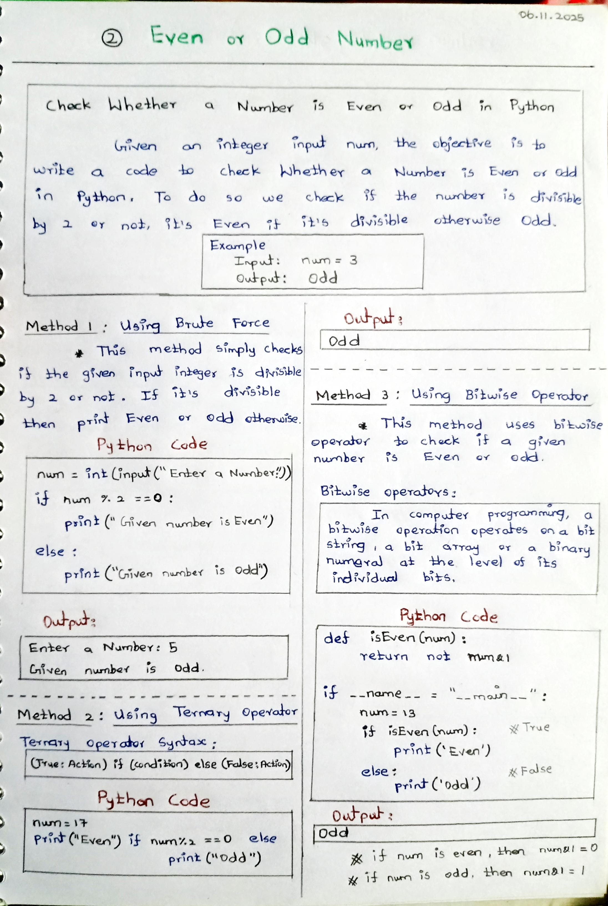
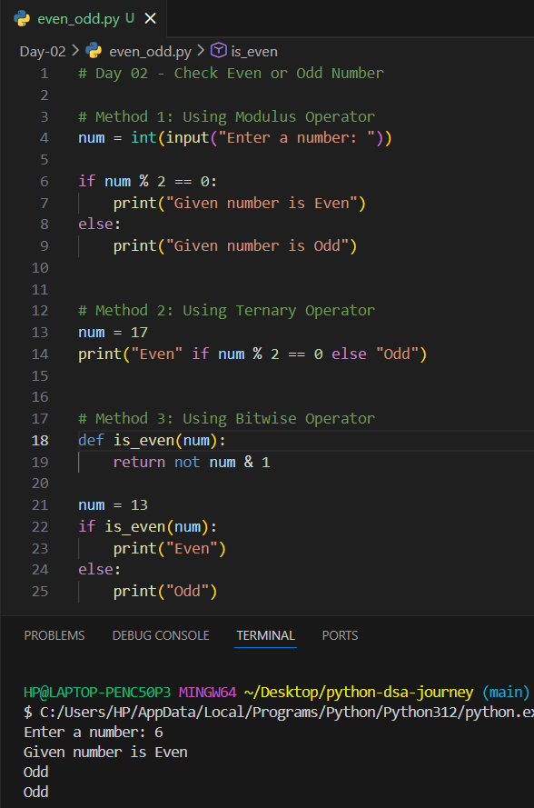

# Day 02 – Check Even or Odd Number (Python)

## 📌 Problem Statement
Write a Python program to check whether a given number is **even** or **odd**.

---

## 🧠 Concepts Used
- Modulus Operator (%)
- Conditional Statements
- Ternary Operator
- Bitwise Operator

---

## 🧪 Methods Implemented

### 1️⃣ Using Modulus Operator
Checks if the number is divisible by 2.

### 2️⃣ Using Ternary Operator
Short and clean conditional check.

### 3️⃣ Using Bitwise Operator
Uses bitwise AND operation to determine parity.

---

## 📷 Output & Notes

### ✏️ Handwritten Notes

### 🖥️ Output Screenshot

---

## ✅ Learning Outcome
- Learned multiple ways to check even or odd numbers
- Understood bitwise operations
- Improved logical thinking in Python

---

## 🚀 Next Step
Continue learning basic DSA problems to strengthen problem-solving skills.