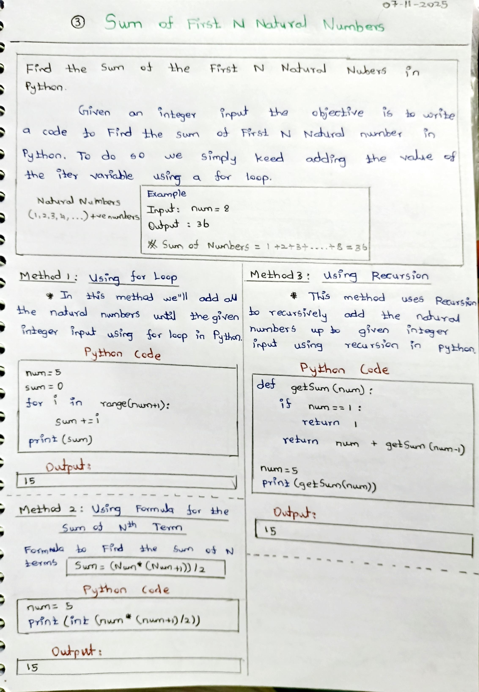
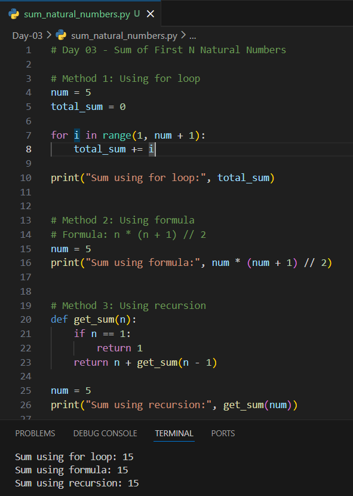

# Day 03 – Sum of First N Natural Numbers (Python)

## 📌 Problem Statement
Write a Python program to find the **sum of the first N natural numbers**.

Natural numbers are:
1, 2, 3, 4, ...

---

## 🧠 Concepts Used
- For loop
- Arithmetic formula
- Recursion
- Functions
- Basic mathematical logic

---

## 🧪 Methods Implemented

### 1️⃣ Using for loop
Adds numbers one by one from 1 to N.

### 2️⃣ Using mathematical formula
Uses the formula:
Sum = n × (n + 1) / 2

### 3️⃣ Using recursion
Recursively adds numbers until the base condition is reached.

---

## 📷 Notes & Output

### ✏️ Handwritten Notes

### 🖥️ Output Screenshot

---

## ✅ Learning Outcome
- Learned iterative, formula-based, and recursive approaches
- Understood when recursion is useful
- Improved logical and mathematical thinking

---

## 🚀 Next Step
Continue practicing basic DSA problems to strengthen fundamentals.