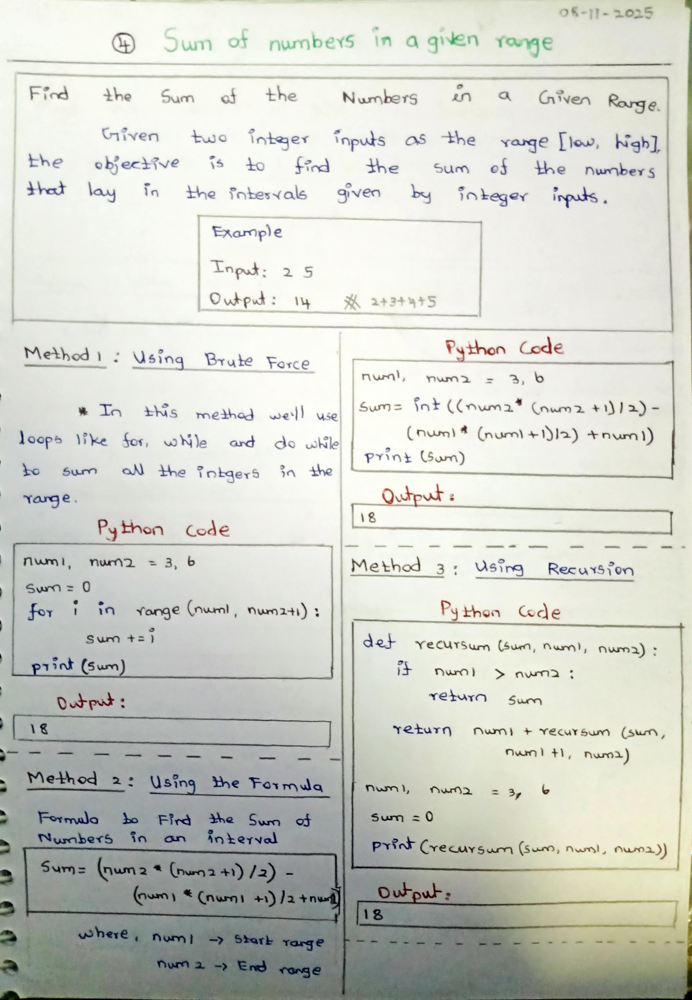
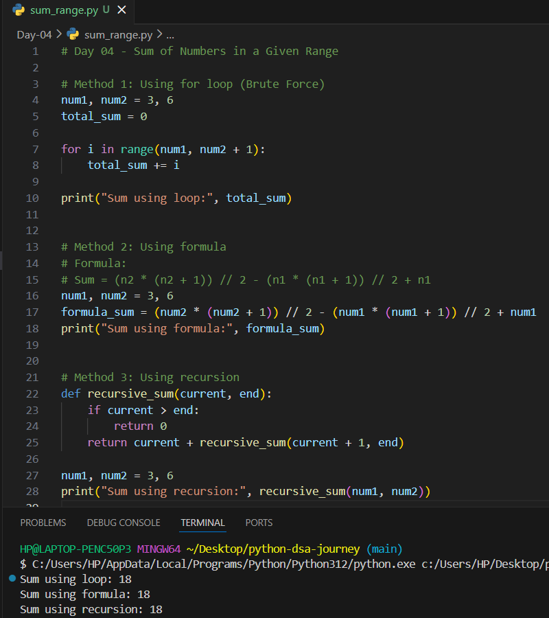

# Day 04 – Sum of Numbers in a Given Range (Python)

## 📌 Problem Statement
Given two integers representing a range `[low, high]`, find the **sum of all numbers** within that range.

---

## 🧠 Concepts Used
- For loop
- Mathematical formula
- Recursion
- Functions
- Logical reasoning

---

## 🧪 Methods Implemented

### 1️⃣ Using for loop (Brute Force)
Iterates through the range and adds each number.

### 2️⃣ Using mathematical formula
Uses arithmetic sum formula to calculate the result efficiently.

### 3️⃣ Using recursion
Recursively adds numbers from the starting value to the ending value.

---

## 📷 Notes & Output

### ✏️ Handwritten Notes

### 🖥️ Output Screenshot

---

## ✅ Learning Outcome
- Learned how to calculate sums in a range
- Understood optimized formula-based solutions
- Practiced recursion for repetitive tasks
- Improved problem-solving skills

---

## 🚀 Next Step
Continue solving DSA problems involving loops, conditions, and recursion.
