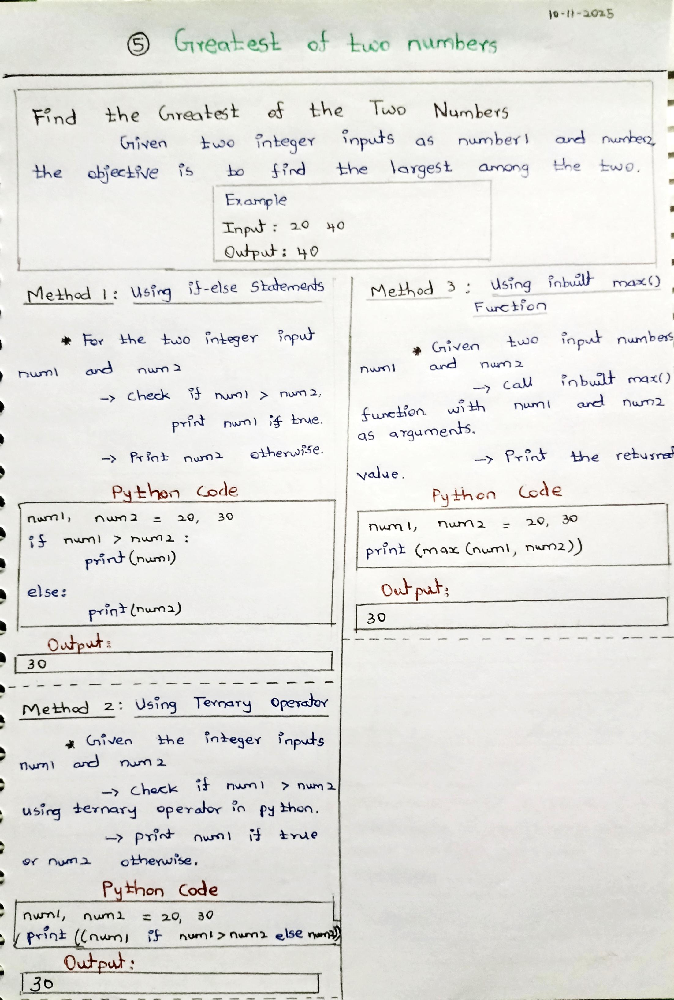
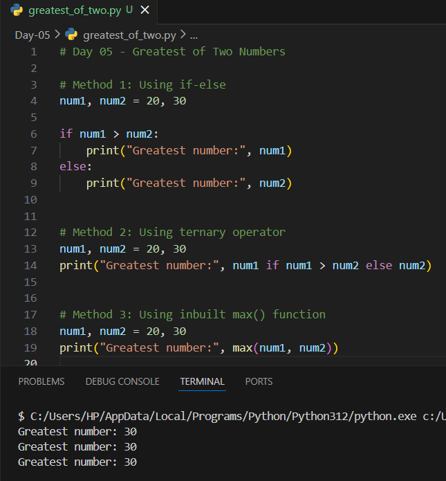

# Day 05 – Greatest of Two Numbers (Python)

## 📌 Problem Statement
Given two integer numbers, find the **greatest (largest) number** among them.

---

## 🧠 Concepts Used
- Conditional statements (if-else)
- Ternary operator
- Built-in functions
- Comparison operators

---

## 🧪 Methods Implemented

### 1️⃣ Using if-else
Compares two numbers and prints the greater one.

### 2️⃣ Using ternary operator
Uses a single-line conditional expression.

### 3️⃣ Using built-in max() function
Uses Python’s inbuilt function to find the maximum value.

---

## 📷 Notes & Output

### ✏️ Handwritten Notes

### 🖥️ Code & Output Screenshot

---

## ✅ Learning Outcome
- Learned different ways to compare values
- Understood when to use built-in functions
- Improved conditional logic in Python

---

## 🚀 Next Step
Practice similar comparison problems and move towards multi-condition logic.