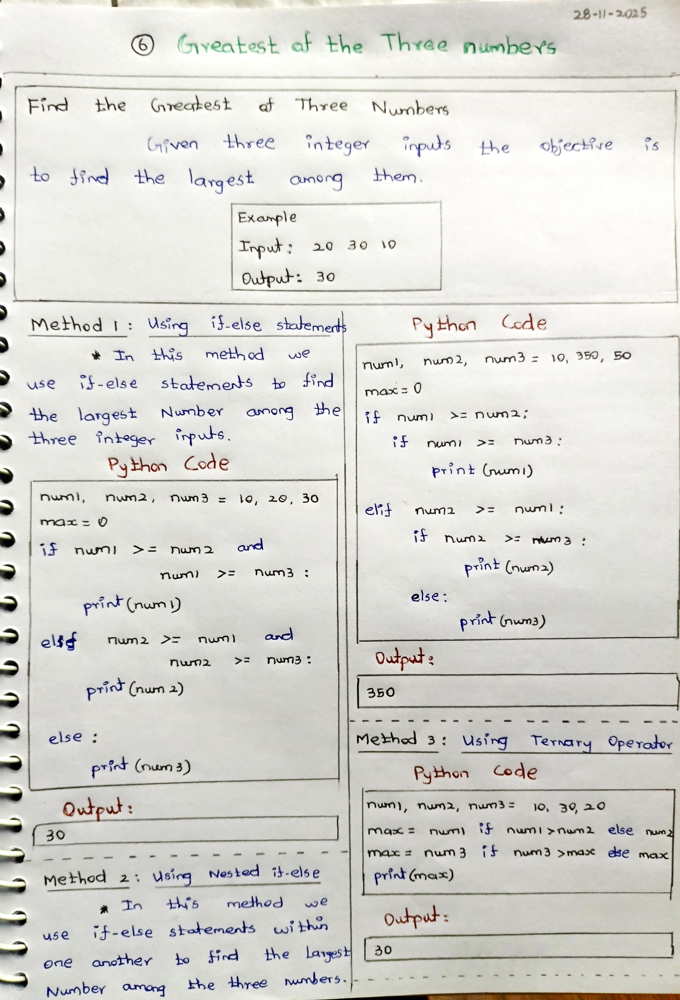
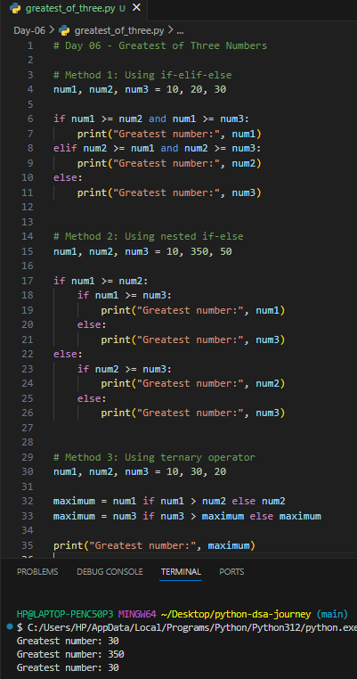

# Day 06 – Greatest of Three Numbers (Python)

## 📌 Problem Statement
Given three integer numbers, find the **greatest (largest) number** among them.

---

## 🧠 Concepts Used
- Conditional statements (if-elif-else)
- Nested if-else
- Ternary operator
- Comparison operators
- Logical operators (and)

---

## 🧪 Methods Implemented

### 1️⃣ Using if-elif-else
Compares all three numbers using logical conditions.

### 2️⃣ Using nested if-else
Uses decision-making inside another condition.

### 3️⃣ Using ternary operator
Finds the maximum value step-by-step using conditional expressions.

---

## 📷 Notes & Output

### ✏️ Handwritten Notes

### 🖥️ Code & Output Screenshot

---

## ✅ Learning Outcome
- Learned how to compare multiple values
- Improved logical decision-making
- Practiced writing clean conditional code

---

## 🚀 Next Step
Move on to number-property problems like prime numbers and factors.