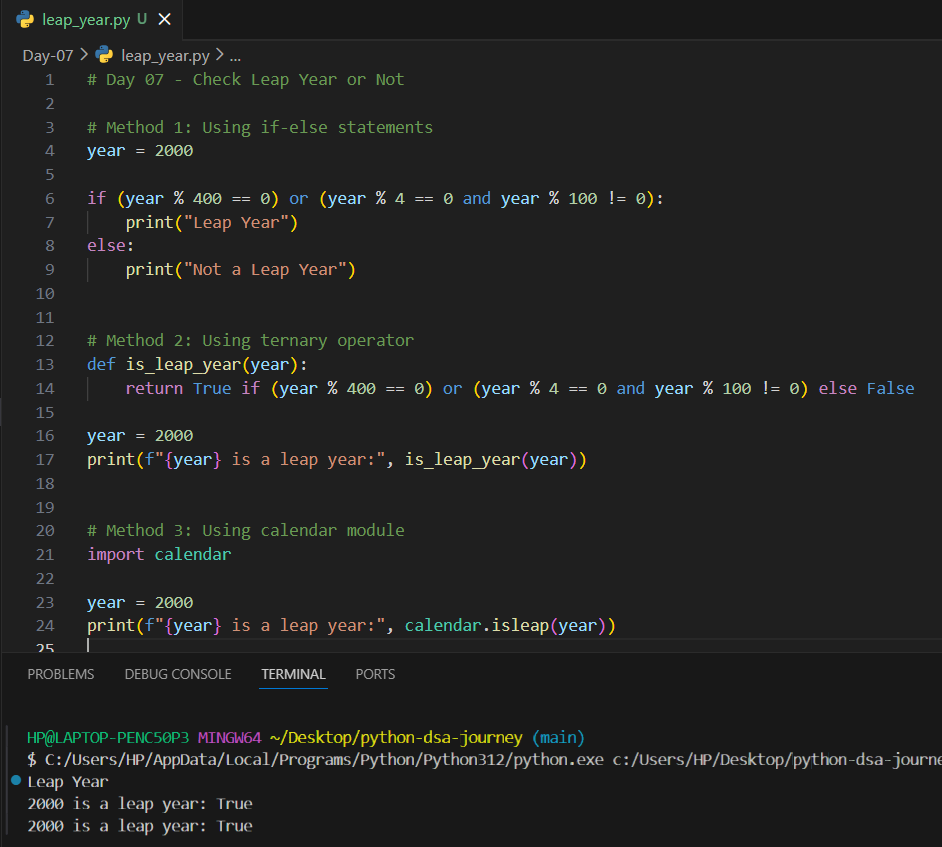

# Day 07 – Check Leap Year or Not (Python)

## 📌 Problem Statement
Given an integer year, determine whether it is a **leap year** or **not**.

---

## 🧠 Conditions for a Leap Year
- The year is divisible by **400**, OR
- The year is divisible by **4** but **not divisible by 100**

---

## 🧠 Concepts Used
- Conditional statements
- Logical operators (and, or)
- Ternary operator
- Python standard library (`calendar` module)

---

## 🧪 Methods Implemented

### 1️⃣ Using if-else statements
Checks leap year conditions manually using arithmetic operators.

### 2️⃣ Using ternary operator
Uses a conditional expression to return `True` or `False`.

### 3️⃣ Using calendar module
Uses Python’s built-in `calendar.isleap()` method.

---

## 📷 Notes & Output

### ✏️ Handwritten Notes

### 🖥️ Code & Output Screenshot

---

## ✅ Learning Outcome
- Understood leap year conditions clearly
- Practiced logical operators
- Learned to use Python’s standard library
- Improved decision-making skills

---
