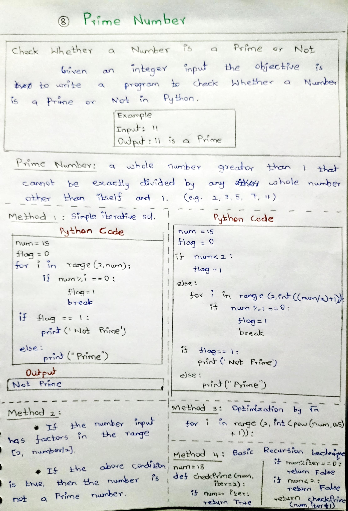
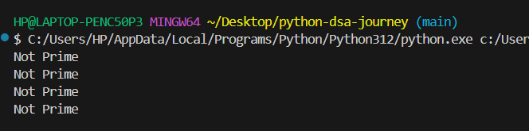

# Day 08 – Check Whether a Number is Prime or Not (Python)

## 📌 Problem Statement
Given an integer number, determine whether it is a **prime number** or **not**.

A prime number is a whole number greater than 1 that has only two factors:
1 and itself.

---

## 🧠 Concepts Used
- Loops
- Conditional statements
- Break statement
- Optimization techniques
- Recursion
- Mathematical reasoning

---

## 🧪 Methods Implemented

### 1️⃣ Simple iterative method
Checks divisibility from 2 to n−1.

### 2️⃣ Optimized method (n/2)
Checks divisibility only up to n/2.

### 3️⃣ Optimized using √n
Checks divisibility only up to the square root of the number.

### 4️⃣ Recursive method
Uses recursion to check divisibility step by step.

---

## 📷 Notes & Output

### ✏️ Handwritten Notes

### 🖥️ Output Screenshot

---

## ✅ Learning Outcome
- Understood what prime numbers are
- Learned optimization techniques
- Practiced recursion
- Improved algorithmic thinking

---
